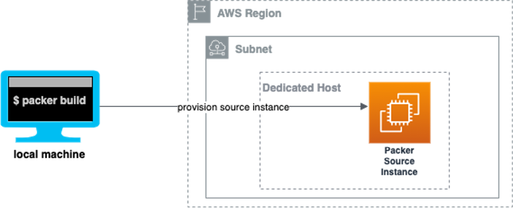

# CircleCI Runner EC2 Mac Terraform

* 

## Features

* 
* 

## Getting Started

### Prerequisites

* Terraform
* Packer

### Build AMI Image using Packer + Ansible

In order to install 

For more information, please take a look at below document.

[Building Amazon Machine Images (AMIs) for EC2 Mac instances with Packer](https://aws.amazon.com/jp/blogs/compute/building-amazon-machine-images-amis-for-ec2-mac-instances-with-packer/)

### Provision using Terraform

For more information, please take a look at below document.

[Implementing Auto Scaling for EC2 Mac Instances](https://aws.amazon.com/jp/blogs/compute/implementing-autoscaling-for-ec2-mac-instances/)

<!-- BEGINNING OF PRE-COMMIT-TERRAFORM DOCS HOOK -->
## Providers

| Name | Version |
|------|---------|
|  [aws](#provider\_aws) | 4.0.0 |
|  [random](#provider\_random) | 3.1.0 |

## Resources

| Name | Type |
|------|------|
| [aws_autoscaling_group.mac_workers](https://registry.terraform.io/providers/hashicorp/aws/latest/docs/resources/autoscaling_group) | resource |
| [aws_autoscaling_policy.mac_workers](https://registry.terraform.io/providers/hashicorp/aws/latest/docs/resources/autoscaling_policy) | resource |
| [aws_cloudformation_stack.mac1_host_resource_group](https://registry.terraform.io/providers/hashicorp/aws/latest/docs/resources/cloudformation_stack) | resource |
| [aws_iam_instance_profile.ssm_inst_profile](https://registry.terraform.io/providers/hashicorp/aws/latest/docs/resources/iam_instance_profile) | resource |
| [aws_iam_role.ec2_role](https://registry.terraform.io/providers/hashicorp/aws/latest/docs/resources/iam_role) | resource |
| [aws_iam_role.ssm_role](https://registry.terraform.io/providers/hashicorp/aws/latest/docs/resources/iam_role) | resource |
| [aws_iam_role_policy_attachment.ec2_attach](https://registry.terraform.io/providers/hashicorp/aws/latest/docs/resources/iam_role_policy_attachment) | resource |
| [aws_iam_role_policy_attachment.ssm_attach](https://registry.terraform.io/providers/hashicorp/aws/latest/docs/resources/iam_role_policy_attachment) | resource |
| [aws_launch_template.mac_workers](https://registry.terraform.io/providers/hashicorp/aws/latest/docs/resources/launch_template) | resource |
| [aws_licensemanager_license_configuration.license_config](https://registry.terraform.io/providers/hashicorp/aws/latest/docs/resources/licensemanager_license_configuration) | resource |
| [aws_licensemanager_license_configuration.mac_workers](https://registry.terraform.io/providers/hashicorp/aws/latest/docs/resources/licensemanager_license_configuration) | resource |
| [aws_security_group.apple_remote_desktop](https://registry.terraform.io/providers/hashicorp/aws/latest/docs/resources/security_group) | resource |
| [aws_ssm_activation.ssm_attach](https://registry.terraform.io/providers/hashicorp/aws/latest/docs/resources/ssm_activation) | resource |
| [random_pet.host_resource_group](https://registry.terraform.io/providers/hashicorp/random/latest/docs/resources/pet) | resource |
| [random_pet.mac_workers](https://registry.terraform.io/providers/hashicorp/random/latest/docs/resources/pet) | resource |
| [random_string.str_prefix](https://registry.terraform.io/providers/hashicorp/random/latest/docs/resources/string) | resource |
| [aws_cloudformation_export.host_resource_group_arn](https://registry.terraform.io/providers/hashicorp/aws/latest/docs/data-sources/cloudformation_export) | data source |

## Inputs

| Name | Description | Type | Default | Required |
|------|-------------|------|---------|:--------:|
|  [ami\_id](#input\_ami\_id) | SSM Parameter used to lookup the EC2 Mac1 AMI | `string` | n/a | yes |
|  [aws\_availability\_zone](#input\_aws\_availability\_zone) | AWS Availability Zone in which Runners will be deployed. | `string` | n/a | yes |
|  [aws\_region](#input\_aws\_region) | AWS Region in which Runners will be deployed. | `string` | n/a | yes |
|  [runner\_auth\_token](#input\_runner\_auth\_token) | Runner auth token.  See docs for how to generate one. https://circleci.com/docs/2.0/runner-installation/#authentication | `string` | n/a | yes |
|  [cf\_stack\_name](#input\_cf\_stack\_name) | Dedicated host CloudFormation stack name. It can include letters (A-Z and a-z), numbers (0-9), and dashes (-). | `string` | `"host-resource-group"` | no |
|  [host\_resource\_group\_prefix](#input\_host\_resource\_group\_prefix) | Prefix used to create ASG Launch template & Host Resource Group license configuration | `string` | `"mac1-"` | no |
|  [mac\_ebs\_volume\_size](#input\_mac\_ebs\_volume\_size) | EC2 Mac1 EBS volume size | `number` | `150` | no |
|  [management\_subnet](#input\_management\_subnet) | Allow access from management subnet | `list(string)` | `[]` | no |
|  [max\_num\_instances](#input\_max\_num\_instances) | Max number of EC2 Mac1 instances in ASG | `number` | `3` | no |
|  [min\_num\_instances](#input\_min\_num\_instances) | Min number of EC2 Mac1 instances in ASG | `number` | `1` | no |
|  [number\_of\_instances](#input\_number\_of\_instances) | Desired Capacity of EC2 Mac1 instances in ASG | `number` | `2` | no |
|  [security\_group\_ids](#input\_security\_group\_ids) | Security Group Ids used by EC2 Mac1 instances in ASG | `list(string)` | `[]` | no |
|  [subnet\_ids](#input\_subnet\_ids) | Subnet Id for each Availability Zone in ASG | `list(string)` | `[]` | no |
|  [vpc\_id](#input\_vpc\_id) | VPC Id for LB Target Group | `string` | `""` | no |
|  [worker\_prefix](#input\_worker\_prefix) | Prefix used to create ASG Launch template & Host Resource Group license configuration | `string` | `"circleci-runner-mac"` | no |
<!-- END OF PRE-COMMIT-TERRAFORM DOCS HOOK -->
