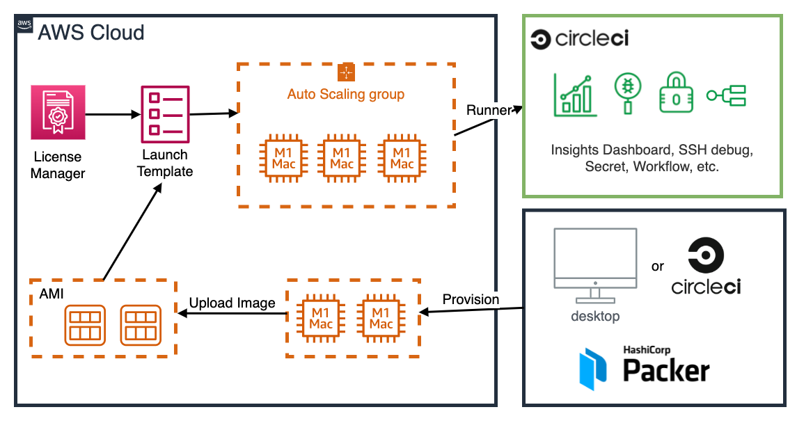
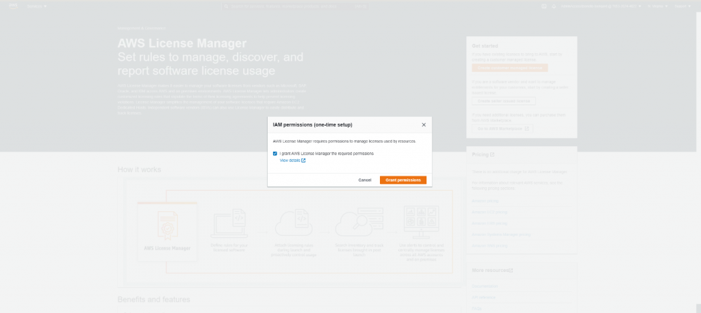

# CircleCI Runner EC2 Mac Terraform

Terraform / Paxcker template to deploy autoscaling CircleCI Runner of [EC2 Mac instances](https://aws.amazon.com/ec2/instance-types/mac/).



## Features

* Better at performance than resource classes which CircleCI Cloud supports(if runners are already provisioned).
* Support EC2 Auto Scalling Group(Currently support cron schedule, since it takes time to provision / cost)

| Resource Class            | CPU   | RAM  |
| ------------------------- | ----- | ---- |
| medium                    | 4CPU  | 8GB  |
| large                     | 8CPU  | 16GB |
| x86 EC2 Mac(`mac1.metal`) | 12CPU | 32GB |
| M1 EC2 Mac(`mac2.metal`)  | 12CPU | 16GB |


* You can build and test iOS app in your private AWS VPC, AWS Region
* You can customize AMI to install other softwares needed for mobile development using Packer(Flutter SDK, etc.)
* You can customize storage of EC2 Mac instances(AWS EBS)
* After AWS provide M1 EC2 Mac(`mac2.metal`), this runner also can suppport(WIP, after M1 EC2 Mac become GA)
* Support [CircleCI Server](https://circleci.com/docs/2.0/server-3-overview/)

## Work in progress

* [Enable SSH debug](https://circleci.com/docs/2.0/runner-overview/#debugging-with-ssh)
* Support other autoscalling solutions
* Support M1 EC2 Mac(`mac2.metal`, after M1 EC2 Mac become GA)
* Use Ansible instead of [install.sh](./images/install.sh)

## Consideration

* EC2 Mac instances are available only as bare metal instances on Dedicated Hosts, with a minimum allocation period of 24 hours before you can release the Dedicated Host.
* Please take special note of the [costs](https://aws.amazon.com/ec2/dedicated-hosts/pricing/) of running EC2 Mac Dedicated hosts for 24 hours
* For EC2 Mac instances, there is a one-to-one mapping between the Dedicated Host and the instance running on this host. This means you are not able to slice a Dedicated Host into multiple instances like you would for Linux and Windows machines.
* To deploy this solution, a Service Quota Increase must be submitted for Dedicated Hosts, as the default quota is 0. Deploying the solution without this increase will result in failures when provisioning the Dedicated Hosts for the mac1.metal instances.
* For more information about EC2 Mac instances, please refer to [this document](https://docs.aws.amazon.com/AWSEC2/latest/UserGuide/ec2-mac-instances.html#mac-instance-considerations).

## Getting Started

### Prerequisites

Please install them in your local machine.

* [CircleCI CLI](https://circleci.com/docs/2.0/local-cli/)
* [Terraform](https://www.terraform.io)
* [Packer](https://www.packer.io)
* [AWS CLI with Session Manager plugin](https://docs.aws.amazon.com/systems-manager/latest/userguide/session-manager-working-with-install-plugin.html)
* [Fastlane](https://docs.fastlane.tools)
* [Apple Developer Program Account](https://developer.apple.com/programs/)

### Build custom AMI using Packer

Please also refer to this document provided by AWS.

[Building Amazon Machine Images (AMIs) for EC2 Mac instances with Packer](https://aws.amazon.com/jp/blogs/compute/building-amazon-machine-images-amis-for-ec2-mac-instances-with-packer/)

In order to build/test iOS app in EC2 Mac instances, you have to install Xcode and other softwares since default AMI does not include them.

Since it takes more than 1 hours to install them(especially Xcode), it's needed to create custom AMIs for EC2 Mac instances.

This time, we will create them with Packer.


Please read [this README](./images/README.md) to create custom AMI using Packer.

### Provision autoscalling EC2 Mac runner using Terraform

Please also refer to this document provided by AWS.

[Implementing Auto Scaling for EC2 Mac Instances](https://aws.amazon.com/jp/blogs/compute/implementing-autoscaling-for-ec2-mac-instances/)

[Official documentation (as of February 2022) states](https://github.com/awsdocs/amazon-ec2-user-guide/blob/master/doc_source/ec2-mac-instances.md): “You cannot use Mac instances with Amazon EC2 Auto Scaling”.

However, with the help of Licence Manager service and Launch Templates, you can set up EC2 Auto Scaling Group for EC2 Mac and leave the automated instance provisioning to the service.


First, we will deploy Dedicated Hosts infrastructure.

Before deploy this, we will do one-time setup for AWS License Manager to have the required IAM Permissions through the AWS Management Console. If you have already used License Manager, this has already been done for you. Click on “create customer managed license”, check the box, and then click on “Grant Permissions.”



Next, we will deploy Dedicated Hosts infrastructure via Terraform.

```sh
terraform -chdir=terraform-aws-dedicated-hosts init
terraform -chdir=terraform-aws-dedicated-hosts plan
terraform -chdir=terraform-aws-dedicated-hosts apply -auto-approve
```

For more info about this module(variables), please read [this README](./terraform-aws-dedicated-hosts/README.md).

After `terraform apply` completes, you will get these outputs, and we will use them in next step.

```
Outputs:

host_resource_group_id = "hogehoge"
license_manager_arn = "arn:aws:license-manager:fugafuga"
```

<br />

Next, we will deploy EC2 Mac Auto Scaling Group.

This is sample `terraform.tfvars`

```tfvars
aws_region                         = "us-east-2"
aws_availability_zone              = "us-east-2b"
host_resource_group_cfn_stack_name = "hoge-host-resource-group"
license_manager_arn                = "arn:aws:license-manager:us-east-2:fuga"
runner_auth_token                  = "runner token"
ami_id                             = "ami-custom-ami"
vpc_id                             = "vpc-hoge"
subnet_ids                         = ["subnet-hoge", "subnet-fuga"]
max_num_instances                  = 3
min_num_instances                  = 1
number_of_instances                = 2
number_of_instances_scale          = 3
scale_up_cron                      = "0 8 * * MON-FRI"
scale_down_cron                    = "0 20 * * *"
```

`license_manager_arn` and `host_resource_group_cfn_stack_name` are outputs of previous step.

In order to create `runner_auth_token`, please refer to [this doc](https://circleci.com/docs/2.0/runner-installation/#authentication).

`ami_id` is custom AMI ID which is created [via Packer](./images/README.md).

For more info about this module(variables), please read [this README](./terraform-aws-ec2-mac/README.md).

```sh
terraform -chdir=terraform-aws-ec2-mac init
terraform -chdir=terraform-aws-ec2-mac plan
terraform -chdir=terraform-aws-ec2-mac apply -auto-approve
```

You can get info about runner status via `circleci runner instance list my-namespace/my-resource-class`.

### Build/Test iOS app

This is sample `.circleci/config.yml` of iOS app using Fastlane.

```yaml
version: 2.1

orbs:
  ruby: circleci/ruby@1.4.0

jobs:
  unit_test:
    machine: true
    resource_class: my-namespace/my-resource-class
    steps:
      - checkout
      - ruby/install-deps
      - run: bundle exec fastlane unit_test

workflows:
  main:
    jobs:
      - unit_test
```

### Cleaning up

Complete the following steps in order to cleanup resources created by this:

```sh
terraform -chdir=terraform-aws-ec2-mac destroy -auto-approve
```

This will take 10 to 12 minutes. Then, wait 24 hours for the Dedicated Hosts to be capable of being released, and then destroy the next template. We recommend putting a reminder on your calendar to make sure that you don’t forget this step.

```sh
terraform -chdir=terraform-aws-dedicated-hosts destroy -auto-approve
```
